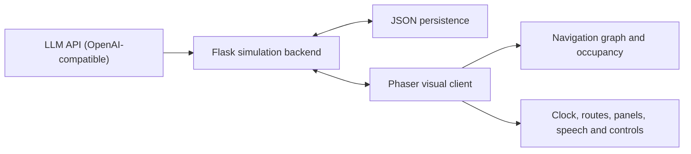

# Valentown

Valentown is an LLM-driven multi-agent virtual society simulation. Seven
residents maintain wake/sleep rhythms, move through a shared town, interact
with one another, accumulate memories, and adapt their behaviour from
persistent internal state.

Agents are **need-driven**: instead of generating a fixed daily plan each
morning, every agent decides its next action only after finishing the previous
one. Each decision is a structured LLM function call grounded in the agent's
current hunger/energy/social needs, its rolling memories, and what it just
did — with deterministic fallback rules so the simulation never stalls when
the LLM is unavailable.

The project combines a Flask simulation backend with a Phaser-based visual
client. The LLM (DeepSeek by default, any OpenAI-compatible endpoint works) is
used for next-action decisions, contextual dialogue, and end-of-day
reflection, while deterministic scheduling and graph-based navigation keep the
simulation inspectable and reproducible.

## Highlights

- Seven autonomous agents with distinct roles, personalities, goals, homes,
  and persistent state.
- **Observe → decide → act loop**: after each completed action the backend is
  asked for the next one (`/decide_next_action`), passing current needs,
  active triggers, location, time, and recent memories.
- **Structured decisions via function calling**: the LLM must fill a typed
  schema (action, destination enum, duration, conversation partner) instead of
  free text — no fragile string parsing, and invalid destinations are
  rejected by construction.
- **Deterministic fallback rules** (hungry → kitchen, tired → sofa, lonely →
  park) keep every agent acting when the LLM fails or is not configured.
- Agent-specific rolling memory banks with a 15-lived-day retention window;
  completed actions and conversations feed back into future decisions.
- End-of-day reflection distils recent experience into higher-level insights.
- Time-dependent hunger, energy, and social needs with configurable thresholds
  and action effects.
- A game clock where one in-game hour corresponds to one real-world minute at
  `1x` speed.
- Orthogonal graph navigation through indoor anchors, building entrances, and
  external roads.
- Collision-aware destination reservation to reduce unnatural overlapping.
- Persistent simulation time, locations, pixel positions, poses, internal
  states, conversations, and memories across server restarts.
- Route visualization, speed controls, collapsible information panels, speech
  bubbles, activity emoji, sleep poses, and animated walk frames.
- Temporary player control of any selected agent through `W`, `A`, `S`, and
  `D`; autonomous decisions pause for that agent until control is released.

## Architecture



### Decision loop

```text
wake up ──► ask /decide_next_action ──► walk to destination ──► act for the
decided duration ──► report /complete_agent_action (memory + need effects)
        ▲                                                            │
        └────────────────────────────────────────────────────────────┘
                       ... until bedtime, then sleep
```

### Backend

The Python backend owns agent definitions, structured next-action decisions
(function calling + validation + deterministic fallback), dialogue generation,
reflection, rolling memory, internal-state updates, and simulation progress
persistence.

### Frontend

The browser client renders the town and agents, advances the simulation clock,
drives the per-agent decision state machine, plans orthogonal routes, enforces
entrance and road rules, animates poses, and exposes inspection and
manual-control tools.

## Technology

- Python 3.10+
- Flask and Flask-CORS
- OpenAI-compatible chat completions API with function calling
  (DeepSeek by default)
- JavaScript
- Phaser 3
- Node.js 18+ and `http-server`
- JSON-based local persistence

## Project Structure

```text
backend/
  agents/                  Agent definitions and decision logic
  memory/                  Rolling memory and reflection system
  agent_state.py           Hunger, energy, social state, and triggers
  llm.py                   OpenAI-compatible LLM client (text + tool calls)
  main.py                  Flask API and simulation orchestration
  tests/                   Unit tests for the deterministic core
frontend/
  assets/                  Town, building, character, and pose sprites
  js/game.js               Rendering, navigation, decision loop, and UI logic
  index.html
  styles.css
scripts/
  smoke_24h.js             Schedule and route smoke test
  generate_walk_sprites.py Walk-frame generation utility
  start_backend.cmd
  start_frontend.cmd
```

## Quick Start

### 1. Clone and enter the repository

```bash
git clone https://github.com/aoaoguo2003/valentown.git
cd valentown
```

### 2. Configure and run the backend

```bash
cd backend
python -m venv .venv
```

Activate the environment:

```powershell
# Windows PowerShell
.\.venv\Scripts\Activate.ps1
```

```bash
# macOS or Linux
source .venv/bin/activate
```

Install the dependencies:

```bash
pip install -r requirements.txt
```

Create the local environment file:

```powershell
# Windows PowerShell
Copy-Item .env.example .env
```

```bash
# macOS or Linux
cp .env.example .env
```

Set `LLM_API_KEY` in `backend/.env` (a DeepSeek key works out of the box;
point `LLM_BASE_URL`/`LLM_MODEL` at any other OpenAI-compatible service if you
prefer), then start the API:

```bash
python main.py
```

The backend runs at [http://localhost:5000](http://localhost:5000). Without an
API key the simulation still runs on deterministic fallback decisions; the LLM
adds personality-driven variety, dialogue, and reflection.

### 3. Run the frontend

Open another terminal:

```bash
cd frontend
npm install
npm start
```

Open [http://localhost:8080](http://localhost:8080).

On Windows, the two scripts in `scripts/` provide the same startup flow after
dependencies have been installed.

## Controls

- `Start`: begin or resume the autonomous simulation.
- `Pause`: pause simulation time and autonomous decisions.
- `1x`, `2x`, `4x`: adjust simulation speed.
- Character buttons or sprites: inspect an agent's location, state, current
  action, destination, and conversation history.
- `Hide Paths` / `Show Paths`: toggle route visualization.
- `<name>'s Path`: isolate the selected agent's route.
- `Control`: pause the selected agent's autonomous decisions and enter manual
  mode.
- `W`, `A`, `S`, `D`: move the manually controlled agent.
- `Release`: return the agent to autonomous decisions from the current state.
- Map arrows: pan across the extended town.

Manual control has priority over an agent's decisions. When released, the
agent reconciles with the current game time: during the day it simply asks for
a fresh decision from wherever it stands; after bedtime it returns home and
goes to sleep. The agent is never teleported back to a former position.

## Persistence

Runtime state is written beneath `backend/`:

- `simulation_progress.json`: current time, positions, locations, and poses.
- `conversations.json`: generated conversations by lived day.
- `agent_internal_states/`: hunger, energy, social values, and time anchors.
- `memory/agent_memory_banks/`: per-agent memories and reflections.

All mutable progress and memory files are ignored by Git.

## API

Useful endpoints include:

- `GET /get_config`
- `POST /decide_next_action`
- `POST /complete_agent_action`
- `POST /generate_conversation`
- `POST /start_new_day`
- `GET /get_conversations?life_day=1`
- `GET /get_simulation_progress`
- `POST /update_simulation_progress`
- `GET /get_agent_internal_state?agent_name=Ron%20Parker`
- `GET /get_agent_memories?agent_name=Ron%20Parker`
- `POST /advance_agent_internal_state`

## Validation

Run the backend unit tests (deterministic core, no LLM calls):

```bash
cd backend
pip install -r requirements-dev.txt
pytest
```

Run the JavaScript syntax check:

```bash
node --check frontend/js/game.js
```

Run the schedule and route smoke test from the repository root:

```bash
node scripts/smoke_24h.js
```

The smoke test validates the deterministic wake/bed schedules, verifies that
every destination the backend may choose is routable from every agent's bed
(and back), and checks the co-location rule that decision-driven conversations
depend on — all without making LLM requests.

## Research Scope

Valentown is a research prototype for studying the interaction between
LLM-generated intention, explicit needs, persistent autobiographical memory,
spatial constraints, and human intervention. The current implementation uses a
single-process Flask server and JSON persistence; it is intended for local
experimentation rather than production-scale deployment.
