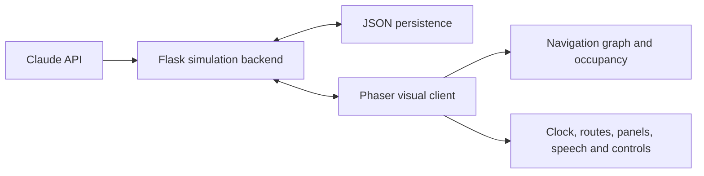

# Valentown

Valentown is an LLM-driven multi-agent virtual society simulation. Seven
residents maintain schedules, move through a shared town, interact with one
another, accumulate memories, and adapt their behaviour from persistent
internal state.

The project combines a Flask simulation backend with a Phaser-based visual
client. Claude is used for daily planning, contextual dialogue, and periodic
reflection, while deterministic scheduling and graph-based navigation keep the
simulation inspectable and reproducible.

## Highlights

- Seven autonomous agents with distinct roles, personalities, goals, homes,
  schedules, and persistent state.
- Claude-generated daily activities, destination selection, conversations, and
  memory-grounded reflection.
- Agent-specific rolling memory banks with a 15-lived-day retention window.
- Time-dependent hunger, energy, and social needs with configurable thresholds
  and action effects.
- A game clock where one in-game hour corresponds to one real-world minute at
  `1x` speed.
- Orthogonal graph navigation through indoor anchors, building entrances, and
  external roads.
- Collision-aware destination reservation to reduce unnatural overlapping.
- Persistent simulation time, locations, pixel positions, poses, internal
  states, and memories across server restarts.
- Route visualization, speed controls, collapsible information panels, speech
  bubbles, activity emoji, sleep poses, and animated walk frames.
- Temporary player control of any selected agent through `W`, `A`, `S`, and
  `D`; autonomous scheduling pauses for that agent until control is released.

## Architecture



### Backend

The Python backend owns agent definitions, Claude requests, daily-plan caching,
dialogue generation, reflection, rolling memory, internal-state updates, and
simulation progress persistence.

### Frontend

The browser client renders the town and agents, advances the simulation clock,
executes schedules, plans orthogonal routes, enforces entrance and road rules,
animates poses, and exposes inspection and manual-control tools.

## Technology

- Python 3.10+
- Flask and Flask-CORS
- Anthropic Messages API
- JavaScript
- Phaser 3
- Node.js 18+ and `http-server`
- JSON-based local persistence

## Project Structure

```text
backend/
  agents/                  Agent definitions and planning prompts
  memory/                  Rolling memory and reflection system
  agent_state.py           Hunger, energy, social state, and triggers
  claude.py                Anthropic API client
  main.py                  Flask API and simulation orchestration
frontend/
  assets/                  Town, building, character, and pose sprites
  js/game.js               Rendering, navigation, schedules, and UI logic
  index.html
  styles.css
scripts/
  smoke_24h.js             Schedule and route smoke test
  generate_walk_sprites.py Walk-frame generation utility
  start_backend.cmd
  start_frontend.cmd
```

## Quick Start

### 1. Clone and enter the repository

```bash
git clone https://github.com/aoaoguo2003/valentown.git
cd valentown
```

### 2. Configure and run the backend

```bash
cd backend
python -m venv .venv
```

Activate the environment:

```powershell
# Windows PowerShell
.\.venv\Scripts\Activate.ps1
```

```bash
# macOS or Linux
source .venv/bin/activate
```

Install the dependencies:

```bash
pip install -r requirements.txt
```

Create the local environment file:

```powershell
# Windows PowerShell
Copy-Item .env.example .env
```

```bash
# macOS or Linux
cp .env.example .env
```

Set `ANTHROPIC_API_KEY` in `backend/.env`, then start the API:

```bash
python main.py
```

The backend runs at [http://localhost:5000](http://localhost:5000).

`backend/life_plans.json` contains cached sample plans. Claude is called when a
requested lived day is not already cached. API keys are intentionally excluded
from version control.

### 3. Run the frontend

Open another terminal:

```bash
cd frontend
npm install
npm start
```

Open [http://localhost:8080](http://localhost:8080).

On Windows, the two scripts in `scripts/` provide the same startup flow after
dependencies have been installed.

## Controls

- `Start`: begin or resume the autonomous simulation.
- `Pause`: pause simulation time and autonomous scheduling.
- `1x`, `2x`, `4x`: adjust simulation speed.
- Character buttons or sprites: inspect an agent's location, state, schedule,
  plan, destination, and conversation history.
- `Hide Paths` / `Show Paths`: toggle route visualization.
- `<name>'s Path`: isolate the selected agent's route.
- `Control`: pause the selected agent's autonomous plan and enter manual mode.
- `W`, `A`, `S`, `D`: move the manually controlled agent.
- `Release`: return the agent to autonomous scheduling from the current state.
- Map arrows: pan across the extended town.

Manual control has priority over an agent's schedule. When released, the agent
reconciles with the current game time: it resumes an active task, returns home
after its return time, or goes to bed after bedtime. The agent is never
teleported back to its former planned position.

## Persistence

Runtime state is written beneath `backend/`:

- `simulation_progress.json`: current time, positions, locations, and poses.
- `life_plans.json`: generated plans and conversations by lived day.
- `agent_internal_states/`: hunger, energy, social values, and time anchors.
- `memory/agent_memory_banks/`: per-agent memories and reflections.

Mutable progress and memory files are ignored by Git, while the cached sample
plan is retained for demonstration.

## API

Useful endpoints include:

- `GET /get_config`
- `GET /get_daily_plan?agent_name=Ron%20Parker&life_day=1`
- `GET /get_conversations?life_day=1`
- `GET /get_simulation_progress`
- `POST /update_simulation_progress`
- `GET /get_agent_internal_state?agent_name=Ron%20Parker`
- `GET /get_agent_memories?agent_name=Ron%20Parker`
- `POST /advance_agent_internal_state`
- `POST /complete_agent_action`

## Validation

Run the JavaScript syntax check:

```bash
node --check frontend/js/game.js
```

Run the backend unit tests (deterministic core, no Claude calls):

```bash
cd backend
pip install -r requirements-dev.txt
pytest
```

Run the 24-hour schedule and route smoke test from the repository root:

```bash
node scripts/smoke_24h.js
```

The smoke test validates schedule ordering, routable destinations, return paths,
conversation co-location, and the configured simulation day window without
making Claude API requests.

## Research Scope

Valentown is a research prototype for studying the interaction between
LLM-generated intention, explicit needs, persistent autobiographical memory,
spatial constraints, and human intervention. The current implementation uses a
single-process Flask server and JSON persistence; it is intended for local
experimentation rather than production-scale deployment.
