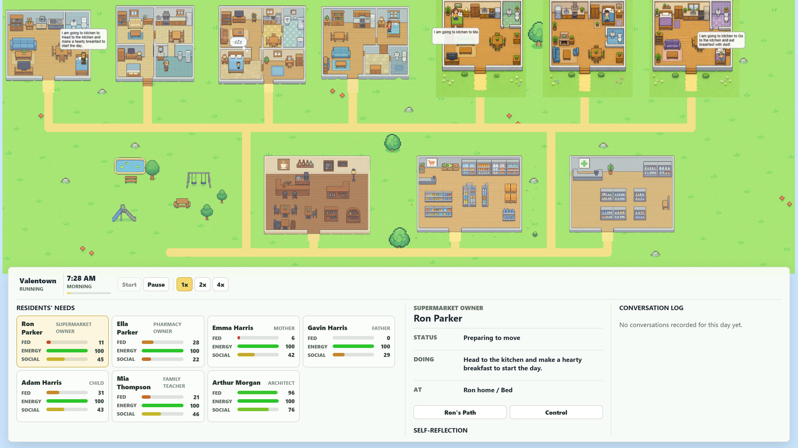
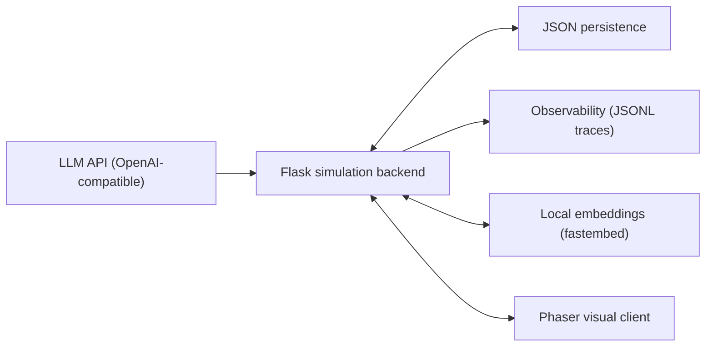

<div align="center">

# Valentown

**An LLM-driven multi-agent virtual town — seven residents who decide, remember, reflect, and talk on their own.**

English · [简体中文](README.zh-CN.md)



</div>

---

## What is Valentown?

Valentown is a small, self-contained **generative-agent simulation**. Seven residents live in a shared town: they wake and sleep on their own rhythms, feel hunger / energy / social needs that change over time, walk through doorways to kitchens, shops, the park and the café, hold short conversations, accumulate memories, reflect each night, and let those reflections reshape how they behave the next day.

It is built as a study of **how to engineer an LLM agent that holds up in practice** — not a chatbot wrapper. Every moving part that a production agent needs is here in miniature and working end to end:

- structured decisions via **forced function calling** (no fragile text parsing),
- a **deterministic fallback** so the simulation never stalls when the LLM is down,
- **memory** with LLM-judged importance and **three-factor retrieval** (recency × importance × relevance),
- a **reflection → evolving persona → behaviour** loop,
- **observability** (full-trace logging of every model call) and an **offline evaluation harness**.

The backend is a Flask simulation engine; the frontend is a Phaser town that renders the whole map on one plane and visualizes each resident's needs live.

> Inspired by Stanford's *Generative Agents: Interactive Simulacra of Human Behavior* (Park et al., 2023), re-implemented and engineered from scratch.

---

## Highlights

### Agent decision loop
- **Observe → decide → act.** After finishing each action an agent asks the backend for its next one, grounded in its current needs, active triggers, location, time, and retrieved memories.
- **Structured output via function calling.** The model must fill a typed schema (`action`, `destination` enum, `duration`, `talk_to`) — invalid destinations are rejected by construction, so there is no free-text parsing.
- **Deterministic fallback rules** (hungry → kitchen, tired → sofa, lonely → park) keep every agent acting when the LLM fails, is rate-limited, or is not configured at all.

### Memory, retrieval & reflection
- **Per-agent rolling memory** with a 15-lived-day retention window; completed actions and conversations feed back into future decisions.
- **LLM-judged importance** — each memory is scored 1–10 for poignancy (a routine meal scores low, a heartfelt talk scores high) instead of a hardcoded constant.
- **Three-factor retrieval** — memories are ranked by `recency × importance × relevance`, where relevance is cosine similarity over **local embeddings** (fastembed / bge-small, no API key, runs offline). Weights are configurable.
- **Reflection → persona loop** — each night an agent distils its most identity-relevant memories into an evolving self-description, which is injected back into its decision prompt so reflection actually shapes behaviour.

### Engineering & observability
- **Full-trace observability** — every LLM call is logged as structured JSONL (trace id, operation, latency, token usage, retries, outcome); calls within one decision share a trace id for end-to-end attribution. `scripts/llm_stats.py` aggregates it by operation and agent.
- **Offline evaluation harness** — fixed scenarios are run through the decision loop and scored on transparent rubrics (structural validity, whether the chosen destination addresses an active need), with latency and token cost pulled from the trace.
- **Robust LLM client** — OpenAI-compatible, with exponential-backoff retries, timeouts, and graceful degradation everywhere.
- **Unit-tested deterministic core** — 23 offline tests covering the clock, need triggers, memory bank, retrieval scoring, persona store, and the fallback decision logic.

### Visualization
- The **entire town renders on one plane** (no scrolling); residents' three needs are shown as live colour-coded bars (green = satisfied, red = needs attention).
- Doorway-funnelled navigation, static speech bubbles, activity emoji, sleep poses, animated walking, route inspection, speed controls, and temporary manual control (`W/A/S/D`) of any resident.

---

## Architecture



```text
wake up ─► /decide_next_action ─► walk through the door ─► act for the decided
        ▲   (function call + validation + fallback)          duration
        │                                                        │
        └──────────── report /complete_agent_action ◄───────────┘
                      (memory + need effects)
        ... at night: /start_new_day ─► reflect ─► update persona
```

- **Backend** owns agent definitions, structured next-action decisions, dialogue, nightly reflection, rolling memory + three-factor retrieval, internal-state updates, observability, and persistence.
- **Frontend** renders the town, advances the clock, drives the per-agent decision state machine, plans doorway-aware routes, and visualizes needs / persona / conversations.

---

## Technology

- Python 3.10+, Flask, Flask-CORS
- OpenAI-compatible chat-completions API with function calling (DeepSeek by default; any compatible endpoint works)
- `fastembed` (local ONNX embeddings) for memory relevance
- JavaScript, Phaser 3, Node.js 18+
- JSON-based local persistence

---

## Project structure

```text
backend/
  agents/agent.py        Agent definitions + need-driven structured decisions + fallback
  llm.py                 OpenAI-compatible LLM client (text + forced tool calls, retries)
  observability.py       Structured JSONL tracing of every LLM call
  retrieval.py           Three-factor memory retrieval with local embeddings
  memory/
    memory_system.py     Per-agent rolling memory banks (15-day retention)
    reflection.py        Nightly reflection -> evolving persona
    persona_store.py     Per-agent persona persistence
  agent_state.py         Hunger / energy / social state, thresholds, triggers
  main.py                Flask API + simulation orchestration
  eval/                  Offline decision regression harness
  tests/                 Unit tests for the deterministic core
frontend/
  js/game.js             Rendering, navigation, decision loop, needs/persona UI
  index.html, styles.css
scripts/
  llm_stats.py           Aggregate the LLM trace by operation / agent
  smoke_24h.js           Schedule + route smoke test (no LLM calls)
```

---

## Quick start

### 1. Backend

```bash
cd backend
python -m venv .venv
# Windows: .\.venv\Scripts\Activate.ps1   |   macOS/Linux: source .venv/bin/activate
pip install -r requirements.txt
cp .env.example .env        # then set LLM_API_KEY (a DeepSeek key works out of the box)
python main.py              # serves http://localhost:5000
```

The first run downloads a small local embedding model (~100 MB) for memory relevance. **Without an API key the simulation still runs** on deterministic fallback decisions; the LLM adds personality, dialogue, and reflection.

`backend/.env` keys:

```ini
LLM_API_KEY=your_key
LLM_BASE_URL=https://api.deepseek.com   # any OpenAI-compatible endpoint
LLM_MODEL=deepseek-chat
```

### 2. Frontend

```bash
cd frontend
npm install
npm start                   # open http://localhost:8080
```

Click **Start** to run the simulation. Click any resident card to inspect their needs, current action, self-reflection, and conversations.

---

## Validation

```bash
cd backend
pip install -r requirements-dev.txt
pytest                              # 23 deterministic unit tests (no LLM calls)
python eval/run_eval.py --repeats 2 # offline decision-quality regression
python ../scripts/llm_stats.py      # summarise the LLM trace (calls, tokens, latency)
node ../scripts/smoke_24h.js        # schedule + route smoke test
```

---

## Research scope

Valentown is a research prototype for studying the interaction between LLM-generated intention, explicit needs, persistent autobiographical memory, spatial constraints, and human intervention. It runs as a single-process Flask server with JSON persistence — intended for local experimentation, not production-scale deployment.
