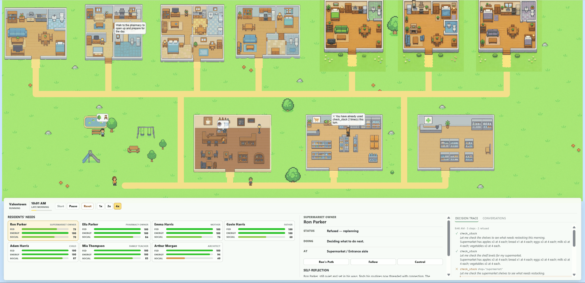

<div align="center">

# Valentown

**A town of seven LLM residents — and a world that is allowed to tell them no.**

English · [简体中文](README.zh-CN.md)



</div>

---

## What this is

Seven residents live in a shared town. They wake on their own rhythms, walk to the
café and the pharmacy, write letters, lend each other money, agree to meet, and
hand things over face to face.

The interesting part is not that an LLM drives them. It is that **the world can
refuse**, and that every design decision behind that world has been measured.

An agent picks a tool. The world checks it against its own rules — the shop is
closed, the person you want is not here, you are five short — and answers. The
agent replans against the refusal. That loop runs until the agent commits to
something that costs game time.

```
State → LLM → tool call → world → observation → LLM → … → action
                            └── may refuse, with a reason ──┘
```

### Before and after

The town used to work differently: one LLM call per turn, the model forced to
fill a fixed schema (`action`, `destination`, `duration`, `talk_to`), and a world
that always said yes. That version is still in the evaluation suite as the
`pre-rebuild` ablation, so the rebuild can be scored against the thing it
replaced rather than against a description of it.

| Task | Now | Before the rebuild |
|---|---|---|
| **errand** — read a letter, take the job, borrow money, buy, arrange a meeting, hand it over | **7/7**, median 74 decisions | **0/2**, stalls at stage 1 of 6, ~215 decisions |
| **rendezvous** — the cake only moves face to face | **6/7**, median 28 decisions | **0/2**, stage 0–1 of 4, ~215 decisions |
| **scarcity** — one box of medicine, two buyers, no overselling | **7/7**, median 40 decisions | **0/2**, stage 1 of 3, ~248 decisions |

The old design never finishes any of them, and burns three to six times the
decisions failing. It can only walk.

<sub>136 evaluation cells · 6.6 hours · 59M tokens · 0 unusable cells · 0 retries.
Baseline and `pre-rebuild` come from the same batch on the same commit. The one
rendezvous failure is traced to a world bug, since fixed — see
[Honest limits](#honest-limits).</sub>

---

## A world that says no

Refusals are not error handling. They are the content: an agent that is never
told no never has to plan.

| Rule | What it costs the agent |
|---|---|
| **You only see people in your own area** | Want to know where someone is? Write and ask. The world knows; no resident does. |
| **Shops keep hours, and have three seats** | Pharmacy 9–18. Turn up late and the door is shut. |
| **Rain closes outdoor spots** | Real London weather, per game hour. Outdoors is decided per anchor, not per area — a café patio shuts while its indoor tables stay open. |
| **15 to start, 15 more every third day** | A coffee costs 8. Asking someone to lend you money is not a flourish, it is the only way through. |
| **Handing something over needs both of you present** | Money can be sent from anywhere. Objects cannot. |
| **Two buyers, one box** | The shelf is decremented inside the same lock that takes the money, so "check then buy" cannot oversell. Thirty-one contested runs, **zero oversells**, and the winner is not always the same resident. |

A refusal never leaks what the agent is not allowed to know:

```
✅  "Emma Harris is not at Café_bar."
❌  "Emma Harris is at Park."          ← would hand out a global location table
```

**Where a refusal points matters more than how often it fires.** Four
experiments on the same wall — an agent standing in the pharmacy five short of
the price:

| Attempt | Where it spoke | Result |
|---|---|---|
| Put prices in the context | before buying | 0/3 |
| Tell the tool description to check the wallet | before buying | 0/3 |
| Require a `cost` field so the model writes the number down | before buying | 0/3 |
| **Name the way out in the refusal itself** | **at the moment of failure** | **0/14 → 3/3** |

The three failures all tried to warn in advance. The model reads right past
them — its own reasoning at the time is just *"Adam has a fever and needs cold
medicine."* Under a goal, constraints go invisible. The wording that worked
offers a fork rather than an answer, and states the one thing the model cannot
infer — that nobody in this town can hand you cash in person.

---

## Proving the parts carry weight

A baseline that scores well proves nothing; the task may simply be easy. Each
capability is removed on its own and the same task is run again.

|  | errand | rendezvous | scarcity |
|---|---|---|---|
| baseline | ✓ 7/7 | ✓ 6/7 | ✓ 7/7 |
| no outgoing mail | **✗ 0/2** — stuck at "afford it" | ✓ 2/2 | ✓ 2/2 |
| no cross-turn task list | **✗ 0/2** | ✓ 2/2 | **✗ 0/2** |
| no arranging meetings | ✓ 2/2 | ✗ 1/2 | ✓ 2/2 |
| one reasoning step per turn | **✗ 0/2** | ✗ 1/2 | **✗ 0/2** |
| pre-rebuild | **✗ 0/2** | **✗ 0/2** | **✗ 0/2** |

**The failures cross.** Taking away outgoing mail kills the errand and leaves the
rendezvous untouched; taking away meetings does the reverse. Nothing collapses
across the board, which is what tells you the suite is measuring capabilities
rather than fragility.

<sub>One row is not clean: removing meetings also silences the hand-over prompt,
which hangs off having a goal at all — so its rendezvous column is not
attributable to the meeting tool alone. An ablation has to remove exactly one
thing; this one removes one and a half, and is noted rather than quietly used.</sub>

The sharpest result is the multi-step loop. `single-step` gives the model all
fourteen tools but only one reasoning step per turn. It fails the errand and the
scarcity run, and passes the rendezvous once:

> The errand needs the agent to change its mind **inside one turn** — check the
> shelf, discover it is five short, and switch to writing for a loan before the
> turn ends. The rendezvous never does: walking over is one turn, handing the
> cake over is the next.

So the loop is not a general intelligence upgrade. **It buys exactly one thing:
the ability to replan without spending game time**, and it only shows up where
the task demands that.

Measured across 10,212 turns of the three seeded tasks: **1,640 refusals, and
after a refusal the agent chooses differently 100% of the time** (median across
cells). The world argues back and the agent listens.

---

## Engineering

**Slow I/O never holds the lock.** The LLM call (up to 60s) and the weather
request happen outside the critical section; the lock is taken twice per
decision, for microseconds — once to read a world snapshot, once to commit.

```
seven residents, one step each     0.25s      one call is 0.20s — near-perfect overlap
seven residents, two steps each    0.42s      two calls are 0.40s
the same work with the call inside the lock    1.43s   ← what the old design did
```

The third row is a deliberate counter-proof kept in the suite: if anyone moves a
slow call back inside the lock, the first two tests stop meaning anything and
this one goes red. (And **not** asyncio — threads already overlap perfectly on
I/O, and being able to explain why is worth more than the rewrite.)

**Committing re-runs the handler.** The world the model reasoned about is
seconds old; the last seat may be gone. The decision is validated again against
a fresh snapshot before it takes effect.

**A breaker for faults that will not heal.** 401/402/403 are account-level. On
the first one the client latches open and every later call returns immediately.
Before it existed, a drained balance produced 1,927 doomed requests and thirty
cells of garbage that read on the scorecard as *"the model is bad."* Under the
same injected fault: one request.

**A scorecard that admits what it does not know.** A cell where the model never
answered is marked `ERR` and excluded from the comparison entirely; a cell cut
off by its decision budget is marked `✗⏱`, not `✗`. Multi-stage tasks report
which stage they reached, because "bought the medicine but never delivered it"
and "did nothing all day" are not the same failure.

**Tracing, and metrics read back from it.** Every LLM call and every tool step
is appended as JSONL on the hot path; the metrics layer is a separate reader
with no project dependencies, so behaviour and cost can be recomputed offline
from any log, for free.

---

## Memory, retrieval, reflection

- **Rolling per-agent memory**, 15 lived days.
- **LLM-judged importance** — every memory scored 1–10 for poignancy, rather
  than a constant.
- **Three-factor retrieval** — `recency × importance × relevance`, relevance by
  cosine similarity over local embeddings (fastembed / bge-small; no API key,
  runs offline).
- **Nightly reflection → evolving persona → next day's prompt**, so reflection
  actually reaches behaviour.
- Retrieval is a **tool the agent calls** (`recall`), not a top-12 blob injected
  into every prompt.

---

## Honest limits

**The model assumes people are where they ought to be.** `target_absent` is the
single most common refusal — 907 across the evaluation. It walks over to check
instead of writing to ask. A single-step probe reproduces it 3/3.

**It does not check whether it can afford something before buying.** The four
experiments above fixed this at the moment of refusal, which rescues multi-step
runs but not the first choice of a single-step one; that probe is still 0/3.

**One change is in the codebase without having earned its place.** When a
resident is standing in front of the person they owe something to, three lines
say so. A single-step probe went 0/4 → 9/9 on the exact situation. The
end-to-end ablation did not reproduce it: 4/4 baseline against 3/4 with the
lines removed, at n=4. That scenario produces one or two hand-over moments a
day, so a binary verdict is too blunt — separating 90% from 65% would need
about thirty cells per arm. **This is a limit of the measurement, not evidence
against the change**, and it is written here rather than in the highlights.

**One evaluation bug survived into a run.** Re-proposing a meeting that already
existed deleted it for both parties — the rollback matched on pair, place and
time rather than on what the call had just created. It hit exactly one cell out
of 136, which happens to be the only rendezvous baseline failure above, and it
looked on the scorecard exactly like the model giving up. Fixed, with tests on
both halves of the rule.

---

## Quick start

```bash
cd backend
python -m venv .venv
# Windows: .\.venv\Scripts\Activate.ps1   |   macOS/Linux: source .venv/bin/activate
pip install -r requirements.txt
cp .env.example .env        # set LLM_API_KEY — a DeepSeek key works out of the box
python main.py              # http://localhost:5000
```

```bash
cd frontend
npm install
npm start                   # http://localhost:8080
```

The first run downloads a ~100 MB local embedding model for memory relevance.
**Without an API key the town still runs** on deterministic fallback decisions;
the LLM adds the deciding, the talking, and the reflecting.

```ini
LLM_API_KEY=your_key
LLM_BASE_URL=https://api.deepseek.com   # any OpenAI-compatible endpoint
LLM_MODEL=deepseek-v4-flash
```

---

## Layout

Dependencies run strictly one way, bottom to top.

```
world/       what the town is made of — clock, places, economy, weather,
             mailbox, goals, events, and the one place a snapshot is assembled
   ↑
tools/       what an agent may do to it — 14 tools, each a schema + handler
   ↑
runtime/     the decision loop, the scheduler, the context builder.
             Knows about no specific tool.
   ↑
api/ main.py the HTTP contract and a thin launcher

agents/  memory/  observability/  evals/  llm/     used by the layers above
```

| Package | What lives there |
|---|---|
| `world/` | Data and atomic operations. `economy.py` deliberately holds goods *and* money: buying changes five things at once, and **the atomicity boundary decides the module boundary**. |
| `tools/` | The registry. Each tool declares whether it costs game time, how many times per turn it may run, and who is eligible. The loop counts; it does not know what a letter is. |
| `runtime/` | `agent_runtime.py` (the loop), `scheduler.py` (an isolated town, shared by the offline runner and the evaluation suite), `context_builder.py` (what a resident gets to see this turn). |
| `evals/` | Scenarios, ablations, runner, scorecard. Verdicts read world state only. |
| `observability/` | `trace.py` writes on the hot path; `metrics.py` reads logs back and has no project dependencies. |

---

## Commands

```bash
node scripts/smoke_24h.js         # schedule + route smoke test, from the repo root
```

```bash
cd backend
pip install -r requirements-dev.txt
python -m pytest tests/ -q                              # 463 tests, no LLM, no network
python -m observability.metrics logs/<a-trace>.jsonl    # behaviour + cost, offline, free

python ../scripts/dry_run.py --days 2 --scenario errand # drive the whole town (costs money)
python -m evals.tool_choice --repeats 3                 # 8 single-step probes, ~2 minutes
python -m evals.runner --scenario all --ablate all --repeats 2 --note full-matrix
```

Every run gets a numbered directory (`logs/eval_v18_note/`) holding a `run.json`
with the command, the commit, and **whether the tree was dirty** — a version
number that cannot name its code is only a serial number.

---

## Scope

A research prototype: one Flask process, JSON persistence, seven residents. The
frontend is the production scheduler — the backend answers *what next*, the
browser plays it out. Built for local experimentation, not for scale.

> Inspired by *Generative Agents: Interactive Simulacra of Human Behavior*
> (Park et al., 2023); designed and written from scratch.
