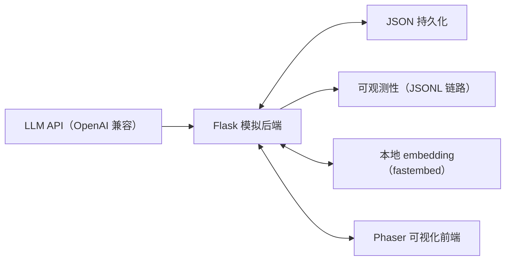

<div align="center">

# Valentown 小镇

**一个由大模型驱动的多智能体虚拟小镇——七位居民会自主决策、记忆、反思与交谈。**

[English](README.md) · 简体中文


</div>

---

## 这是一个什么项目？

Valentown 是一个小而完整的**生成式智能体（Generative Agent）模拟**。七位居民生活在同一座小镇里：他们按各自的作息醒来与入睡，拥有随时间变化的「饥饿 / 精力 / 社交」需求，会穿过门口走到厨房、商店、公园和咖啡馆，进行简短对话，积累记忆，每晚反思，并让反思反过来改变第二天的行为。

它的定位是**研究"如何把一个 LLM 智能体做到工程上立得住"**。一个生产级 Agent 需要的每个关键环节，这里都有一个能端到端跑通的实现：

- 通过**强制函数调用（function calling）**做结构化决策；
- **确定性兜底**，LLM 不可用时模拟也绝不停摆；
- 带 **LLM 评定重要性**的记忆，以及**三因子检索**（新近度 × 重要性 × 相关性）；
- **反思 → 演化人设 → 影响行为**的闭环；
- **可观测性**（每次模型调用的全链路日志）与**离线评测脚手架**。

后端是一个 Flask 模拟引擎；前端是一个 Phaser 小镇，把整张地图渲染在一个平面上，并实时可视化每位居民的需求。

> 灵感来自斯坦福《Generative Agents: Interactive Simulacra of Human Behavior》(Park et al., 2023)，从零重新实现与工程化。

---

## 核心特性

### 决策循环
- **观察 → 决策 → 行动。** 每完成一个动作，居民就向后端请求下一个动作，依据其当前需求、激活的触发器、所在位置、时间和检索到的记忆。
- **函数调用产出结构化结果。** 模型必须填充一个类型化 schema（`action`、目的地 `enum`、`duration`、`talk_to`）——非法目的地从构造上就被拒绝，无需解析自由文本。
- **确定性兜底规则**（饿→厨房、累→沙发、孤独→公园）：当 LLM 失败、被限流或根本未配置时，每个居民依然能正常行动。

### 记忆、检索与反思
- **逐人滚动记忆**，保留最近 15 个生命日；完成的动作与对话会反馈进未来决策。
- **LLM 评定重要性**——每条记忆按 poignancy 打 1–10 分（一顿日常饭分低，一次走心的对话分高），而非写死常数。
- **三因子检索**——记忆按 `新近度 × 重要性 × 相关性` 排序，其中相关性是基于**本地 embedding**（fastembed / bge-small，无需 key、可离线）的余弦相似度；权重可配置。
- **反思 → 人设闭环**——每晚把最能反映身份的记忆提炼成一段会演化的自我描述，并注入回决策提示词，让反思真正改变行为。

### 工程与可观测性
- **全链路可观测**——每次 LLM 调用都以结构化 JSONL 记录（trace id、操作类型、延迟、token 用量、重试、结果）；同一次决策内的多次调用共享 trace id，便于端到端归因。`scripts/llm_stats.py` 可按操作和居民聚合。
- **离线评测脚手架**——把固定场景跑过决策循环，用透明评分标准打分（结构是否合法、所选目的地是否满足当前需求），并从 trace 拉取延迟与 token 成本。
- **健壮的 LLM 客户端**——OpenAI 兼容，带指数退避重试、超时与全程优雅降级。
- **确定性核心有单测**——23 个离线测试，覆盖时钟、需求触发、记忆库、检索打分、人设存储与兜底决策逻辑。

### 可视化
- **整张地图渲染在一个平面上**（无需滚动）；居民的三项需求以实时彩色进度条展示（绿=满足，红=需关注）。
- 门口漏斗式导航、静态对话气泡、活动表情、睡姿、行走动画、路线查看、速度控制，以及对任意居民的临时手动操控（`W/A/S/D`）。

---

## 架构



```text
起床 ─► /decide_next_action ─► 穿门走到目的地 ─► 按决定的时长行动
     ▲   （函数调用 + 校验 + 兜底）                    │
     │                                                 │
     └──────────── 上报 /complete_agent_action ◄───────┘
                   （写入记忆 + 需求变化）
     ... 夜晚：/start_new_day ─► 反思 ─► 更新人设
```

- **后端**负责智能体定义、结构化下一步决策、对话、夜间反思、滚动记忆 + 三因子检索、内在状态更新、可观测性与持久化。
- **前端**负责渲染小镇、推进时钟、驱动逐人决策状态机、规划门口感知的路线，并可视化需求 / 人设 / 对话。

---

## 技术栈

- Python 3.10+、Flask、Flask-CORS
- 支持函数调用的 OpenAI 兼容 chat-completions 接口（默认 DeepSeek，任意兼容端点皆可）
- `fastembed`（本地 ONNX embedding）用于记忆相关性
- JavaScript、Phaser 3、Node.js 18+
- 基于 JSON 的本地持久化

---

## 项目结构

```text
backend/
  agents/agent.py        智能体定义 + 需求驱动的结构化决策 + 兜底
  llm.py                 OpenAI 兼容 LLM 客户端（文本 + 强制工具调用，含重试）
  observability.py       每次 LLM 调用的结构化 JSONL 链路追踪
  retrieval.py           基于本地 embedding 的三因子记忆检索
  memory/
    memory_system.py     逐人滚动记忆库（保留 15 天）
    reflection.py        夜间反思 -> 演化人设
    persona_store.py     逐人人设持久化
  agent_state.py         饥饿 / 精力 / 社交状态、阈值、触发器
  main.py                Flask API + 模拟编排
  eval/                  离线决策回归脚手架
  tests/                 确定性核心的单元测试
frontend/
  js/game.js             渲染、导航、决策循环、需求/人设 UI
  index.html, styles.css
scripts/
  llm_stats.py           按操作/居民聚合 LLM 链路
  smoke_24h.js           作息 + 路线冒烟测试（不调用 LLM）
```

---

## 快速开始

### 1. 后端

```bash
cd backend
python -m venv .venv
# Windows: .\.venv\Scripts\Activate.ps1   |   macOS/Linux: source .venv/bin/activate
pip install -r requirements.txt
cp .env.example .env        # 然后设置 LLM_API_KEY（DeepSeek 的 key 开箱即用）
python main.py              # 监听 http://localhost:5000
```

首次运行会下载一个小的本地 embedding 模型（约 100 MB）用于记忆相关性。**没有 API key 时模拟依然能跑**（走确定性兜底决策）；LLM 负责增加个性、对话与反思。

`backend/.env` 配置项：

```ini
LLM_API_KEY=your_key
LLM_BASE_URL=https://api.deepseek.com   # 任意 OpenAI 兼容端点
LLM_MODEL=deepseek-chat
```

### 2. 前端

```bash
cd frontend
npm install
npm start                   # 打开 http://localhost:8080
```

点击 **Start** 运行模拟。点击任意居民卡片可查看其需求、当前动作、自我反思与对话记录。

---

## 验证

```bash
cd backend
pip install -r requirements-dev.txt
pytest                              # 23 个确定性单元测试（不调用 LLM）
python eval/run_eval.py --repeats 2 # 离线决策质量回归
python ../scripts/llm_stats.py      # 汇总 LLM 链路（调用数、token、延迟）
node ../scripts/smoke_24h.js        # 作息 + 路线冒烟测试
```

---

## 研究范围

Valentown 是一个研究原型，用于探索 LLM 生成的意图、显式需求、持久化自传体记忆、空间约束与人为干预之间的相互作用。它以单进程 Flask 服务 + JSON 持久化运行——面向本地实验，而非生产级部署。
